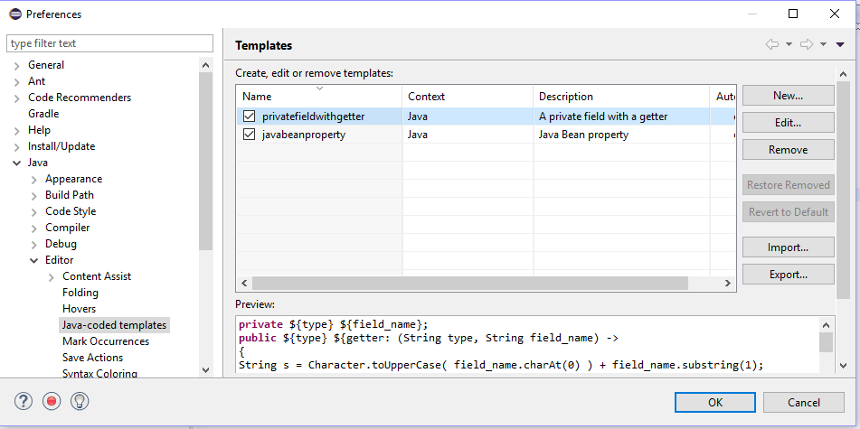
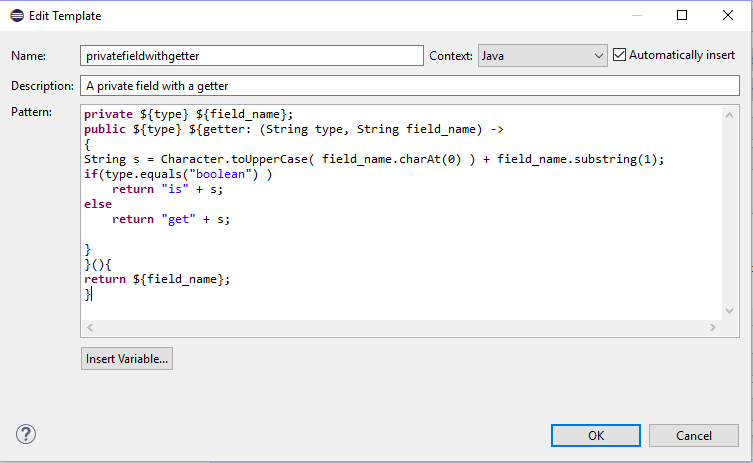

### Introduction
This is an Eclipse plugin that allows the user to write code templates (or code snippets) for the Java editor where some template variables are computed from other template variables.

### What's new :star:

### Version 1.0.0

Initial version.

### Usage
You can enter a new Java-coded template ( or edit an existing one ) via the menu Window -> Preferences -> Java -> Editor -> Java-coded templates. You should now see a list of all your Java-coded templates displayed like in the following screenhot.

Click the New-button to enter a new template. E.g. you could enter a template for a private field with a getter-method like this:

After having successfully written your template, just type the first letters of the template's name into a Java editor and invoke content assist via Ctrl + Space. 

### Installation

In Eclipse, select the menu Help -> Install New Software. Then enter the url https://github.com/florianingerl/com.florianingerl.javacodedcompletionproposals/raw/master/com.florianingerl.javacompletionproposals.feature/export_1.0.0 and hit next, accept and finish until the plugin is installed.

